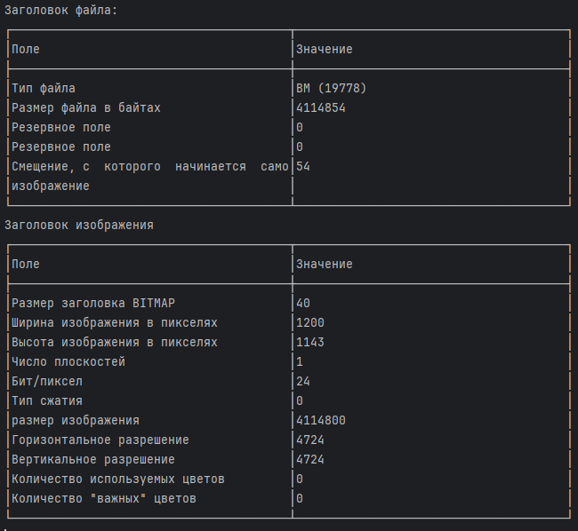

# FoxyBMPTools

Простой набор утилит для работы с bmp картинками.

Позволяет:
- Просмотреть заголовок файла
- Разбить на составляющие цвета
- Выполнить битовые срезы

## Сборка

```shell
mvn clean package
```

## Запуск
```shell
java -jar target/FoxyBMPTools-1.1.2-jar-with-dependencies.jar -p -c -s -i example.bmp
```

Параметры:
- `-p` - выводит заголовки (необязательный)
- `-c` - разбивает в составляющие цвета (необязательный)
- `-s` - разбивает на битовые срезы (необязательный)
- `-i example` - входной файл

## Пример работы

Заголовки


Разбиение на составляющие цвета


Битовые срезы

